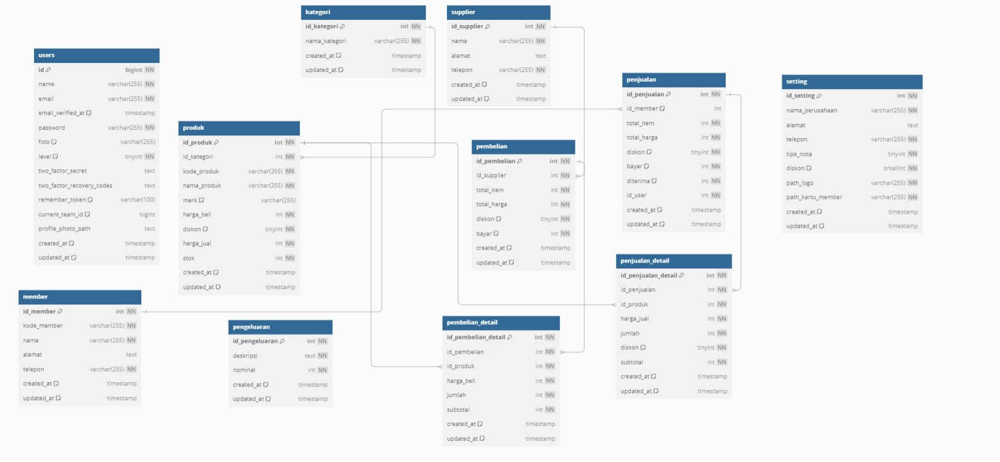
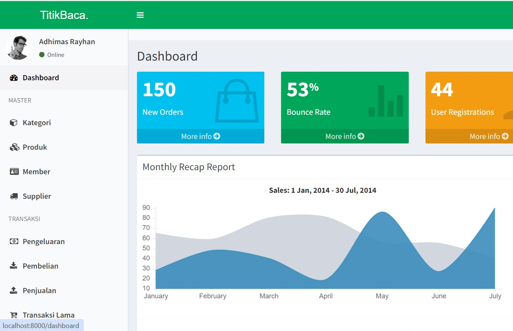
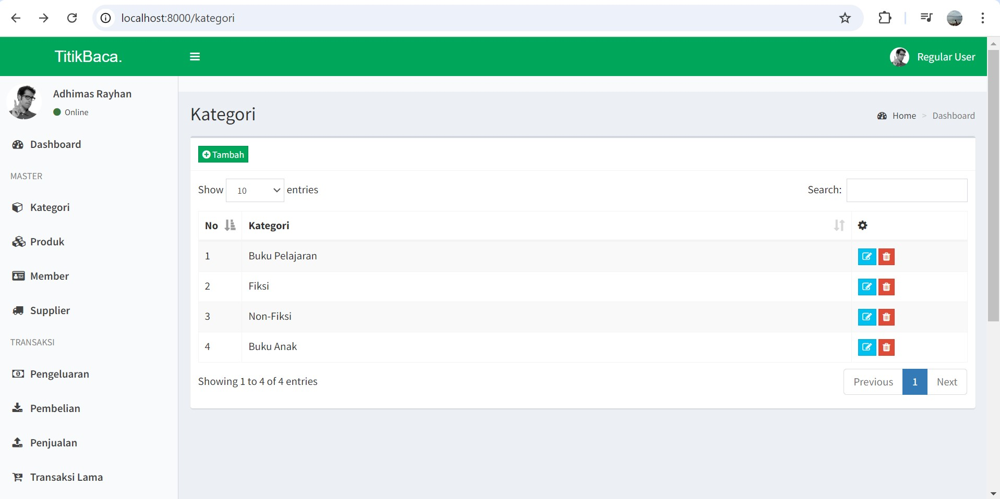
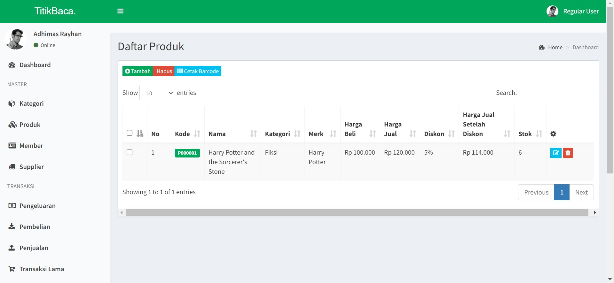
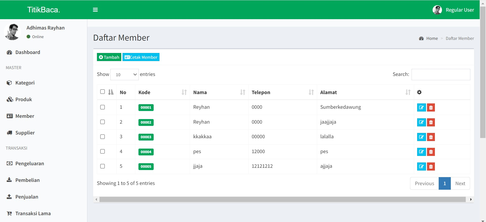
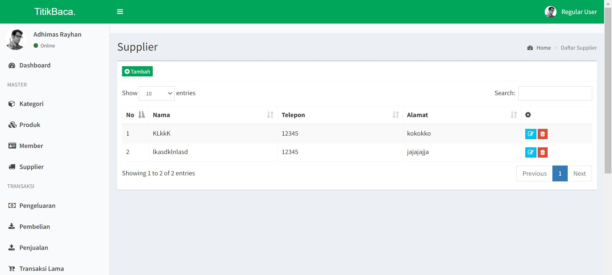

# Titik Baca
Titik Baca adalah halaman admin yang dirancang untuk mengelola operasional sebuah toko buku dengan efisien. Di halaman ini, terdapat fitur Kategori Produk, di mana admin dapat mengatur berbagai jenis buku berdasarkan kategori tertentu, seperti fiksi, non-fiksi, buku anak, dan pendidikan. Pengelolaan kategori ini penting untuk mempermudah pencarian produk oleh pelanggan dan memastikan bahwa semua buku terorganisir dengan baik. Admin memiliki kemampuan untuk menambahkan, mengedit, dan menghapus kategori sesuai kebutuhan, sehingga koleksi buku selalu terupdate dan relevan dengan permintaan pasar.

Selain itu, halaman admin juga dilengkapi dengan fitur Supplier dan Member. Fitur Supplier memungkinkan admin untuk mengelola informasi tentang pemasok buku, termasuk nama, kontak, dan daftar buku yang mereka tawarkan. Dengan pengelolaan data supplier yang efektif, admin dapat memastikan ketersediaan stok dan mempercepat proses pemesanan. Sementara itu, fitur Member memberikan admin kemampuan untuk mengelola data pelanggan, termasuk pendaftaran anggota baru dan pelacakan riwayat pembelian. Hal ini memungkinkan admin untuk memberikan layanan yang lebih baik, seperti penawaran khusus atau diskon bagi anggota tertentu, sehingga meningkatkan loyalitas pelanggan terhadap toko.

## Desain Database

## Screenshot aplikasi

## Dependency
Daftar dependency yang digunakan dalam proyek ini.

- **Laravel Framework**: ^10.0
- **PHP**: ^8.1
- **Barryvdh Laravel DomPDF**: ^3.0
- **Doctrine DBAL**: ^3.9
- **GuzzleHTTP**: ^7.2
- **Laravel Jetstream**: ^4.3
- **Laravel Sanctum**: ^3.2
- **Laravel Tinker**: ^2.8
- **Livewire**: ^3.0
- **Milon Barcode**: ^11.0
- **Yajra Laravel DataTables Oracle**: ^10.11

